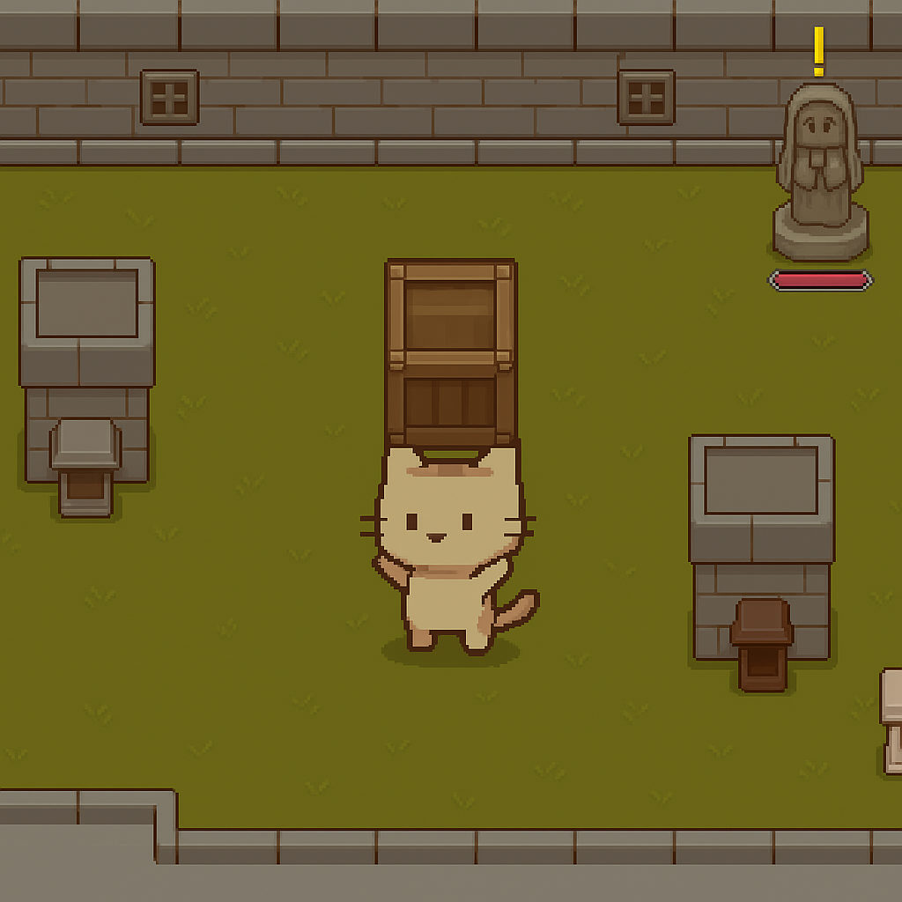
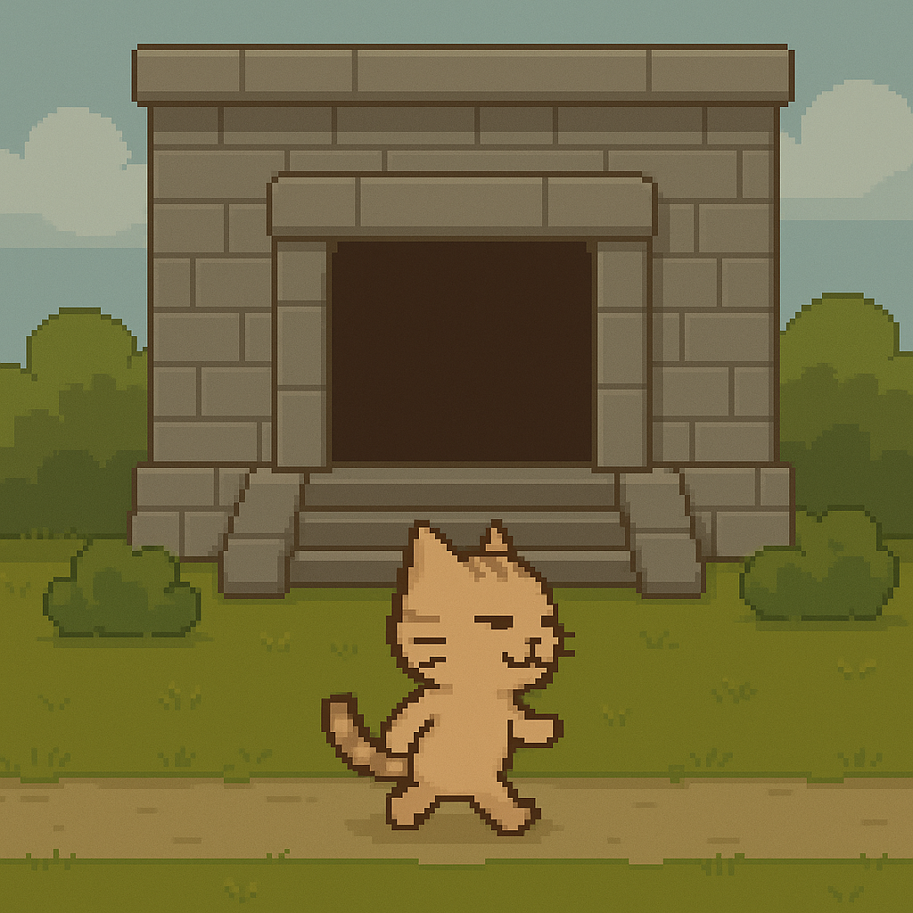
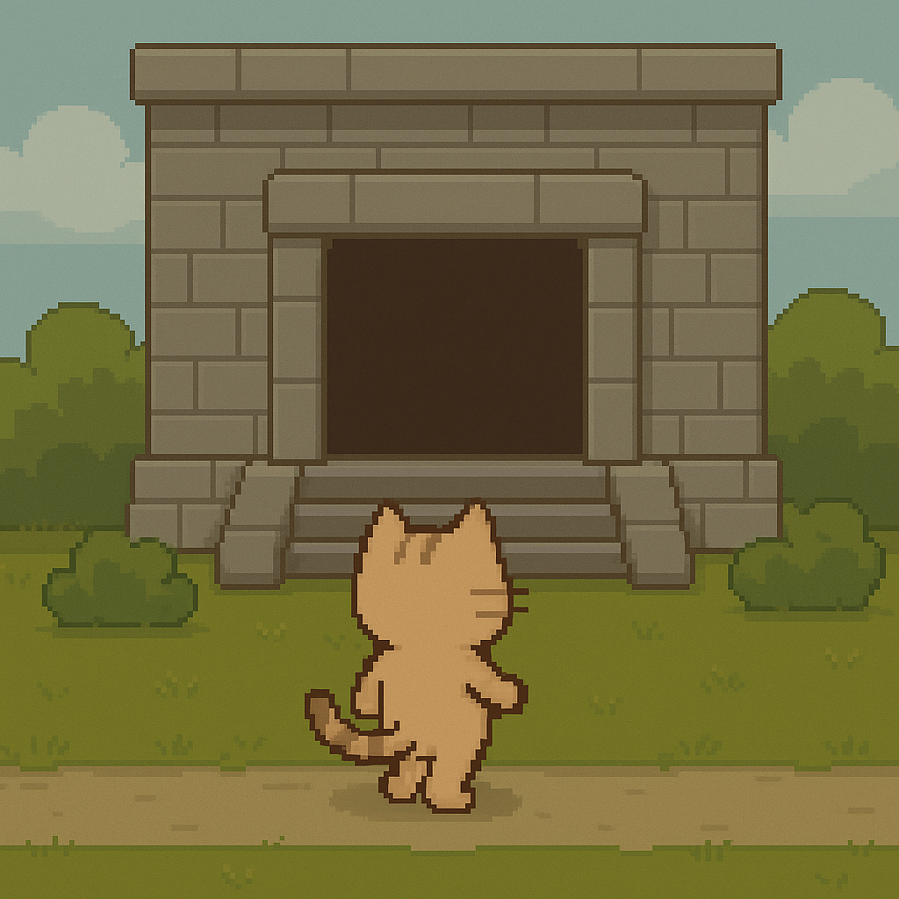
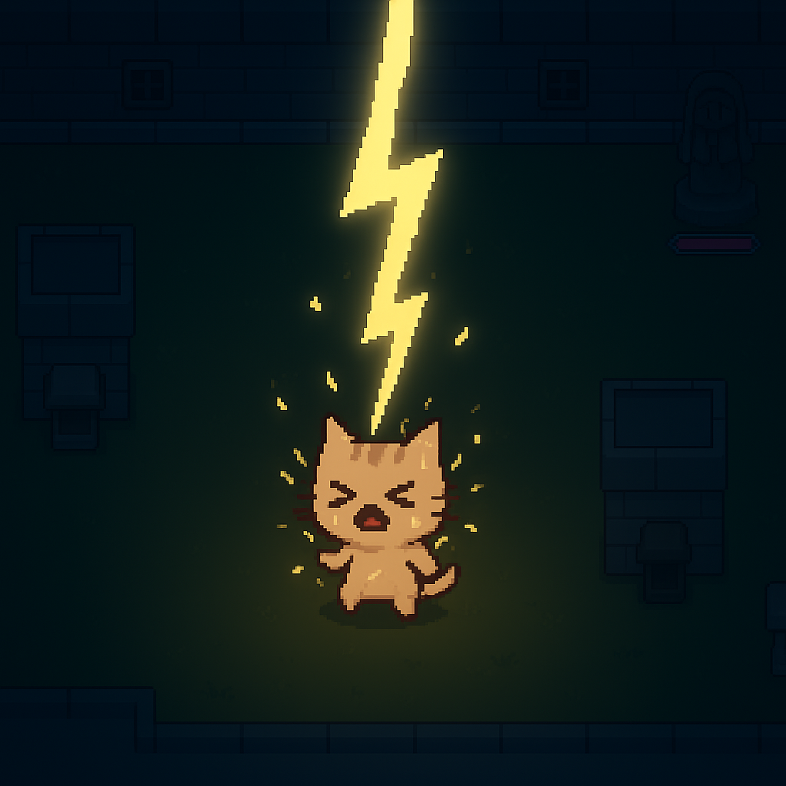
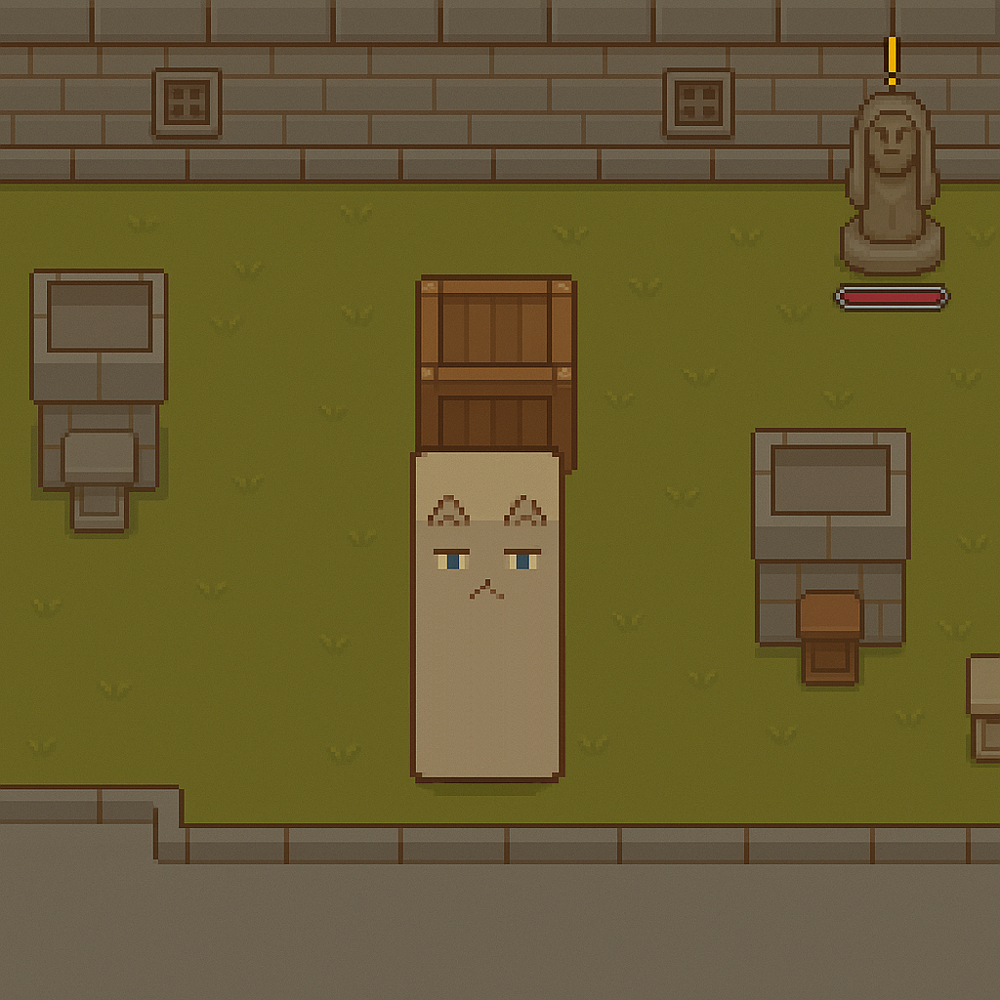

# BoxCat 🐈

> 고양이와 함께 고대의 유적을 수리하는 타임어택 퍼즐 운송 게임!

## 📖 게임 소개 (About The Game)

이 게임은 플레이어가 민첩한 고양이가 되어, 고장 난 고대의 유적 장치들을 수리하는 타임어택 퍼즐 게임입니다. 단순히 적을 피하는 것을 넘어, "어떻게 하면 제한 시간 안에, 어떤 방법으로, 어떤 경로를 통해 부품(박스)을 안전하고 빠르게 배달할 것인가?" 대한 퍼즐 해결과 전략에 집중하는 경험을 제공합니다.

---

## 스토리 (Story)

<table>
  <tr>
    <td></td>
    <td></td>
    <td></td>
    <td></td>
  </tr>
</table>

호기심에 들어간 고대 유적에서 정체불명의 번개를 맞고 네모난 '박스 고양이'가 되어버렸다!

저주를 풀 유일한 방법은 고장 난 유적의 고대 장치들을 모두 수리하는 것. 과연 우리의 주인공은 유적의 비밀을 파헤치고 무사히 원래 모습으로 돌아갈 수 있을까?

## ✨ 주요 특징 (Key Features)

### 🧩 타임어택 퍼즐 운송
각 레벨의 목표는 제한 시간 안에 필요한 개수만큼의 장치를 수리하는 것입니다. 전투의 긴장감보다는 퍼즐 해결의 성취감과 시간 단축의 쾌감에 초점을 맞춥니다.

### 🎒 두 가지 운송 방식: 들기 vs 끌기
플레이어는 부품(박스)을 두 가지 방식으로 운반할 수 있으며, 상황에 맞는 최적의 선택을 해야 합니다.

* **들기 (Carrying):** 머리 위에 여러 개의 박스를 쌓아 운반합니다. 가장 나중에 든 박스만 먼저 사용할 수 있습니다(LIFO). 4개 이상부터는 무게 페널티로 속도가 느려지며, 6-7개를 들면 압사합니다.
* **끌기 (Pulling/Pushing):** 박스를 하나씩만 밀거나 끌어서 운반합니다. 속도는 느리지만 특정 환경 장애물을 통과하기 위해 필수적입니다.

## 👾 등장하는 적과 장애물 (Enemies & Obstacles)
이 게임의 적들은 플레이어를 직접적으로 패배시키기보다, 수리 과정을 방해하고 시간 손실을 유발하여 퍼즐의 난이도를 높이는 역할을 합니다.

### 끈끈이 슬라임 (Sticky Slime) 🦠
플레이어를 집요하게 따라다니며 경로를 방해하는 슬라임입니다. 직접적인 공격력은 없지만, 계속해서 플레이어의 동선을 꼬이게 만들어 전략적인 움직임을 강요합니다. 터뜨리면 일정 시간 후에 플레이어로부터 가장 먼 곳에서 다시 나타납니다.

### 낙하 슬라임 (Falling Slime) 💧
주기적으로 플레이어의 위치에 경고 표시가 나타난 뒤, 잠시 후 하늘에서 끈적한 슬라임 덩어리가 떨어집니다. 플레이어가 한곳에 오래 머무는 것을 방해하며, 계속해서 움직이도록 강제하는 역할을 합니다.

### 폭발 슬라임 (Burst Slime) 💥
플레이어 주변에 갑자기 나타나 몸을 부풀렸다가, 잠시 후 8방향으로 슬라임 파편을 발사하고 사라집니다. 좁은 길목에 나타나면 매우 위협적이며, 빠른 상황 판단과 회피를 요구합니다.

### 레이저 (Laser) ⚡
맵의 한쪽 끝에서 반대쪽 끝까지 경로를 예고하는 경고선이 나타난 뒤, 잠시 후 강력한 레이저가 발사됩니다. 레이저는 맵의 특정 구역을 일시적으로 차단하여, 플레이어의 동선을 크게 제약하고 다른 경로를 찾도록 유도합니다.

## 📦 화물 중심의 위협
적들은 플레이어를 직접 공격하지 않습니다. 대신, 플레이어가 운반 중인 **박스를 파괴**하려는 공격을 합니다. 이 게임의 핵심 페널티는 플레이어의 '죽음'이 아닌, **'박스 파괴로 인한 시간 손실'**과 **'경직으로 인한 딜레이'**입니다.

---

## 🕹️ 조작법 (Controls)

| 키         | 액션             |
| :--------- | :--------------- |
| **WASD or 방향키** | 플레이어 이동    |
| **E** | 상호작용 (줍기, 장치에 제출 등) |
| **Q** | 들고 있는 박스 내려놓기   |

---

## 🛠️ 사용 기술 (Built With)

* **Engine:** Unity `[6000.1.11f1]`
* **Language:** C#
* **Art:** `Aseprite`
* **Asset:** A* Pathfinding Project (Free Version)

---

## 🚧 개발 현황 및 향후 계획 (To-Do)

**현재 구현된 기능:**
* [x] 플레이어 이동 및 상호작용
* [x] 박스 들기 & 끌기 시스템
* [x] 무게에 따른 속도 페널티
* [x] 박스 생산대 및 수리 장치
* [x] 기본 환경 장애물 (바람/불 장판)
* [x] 단순 패턴의 적 (유령, 자폭맨)

**향후 추가될 기능:**
* [ ] 다양한 레벨과 새로운 환경 퍼즐 추가
* [ ] 사운드 이펙트 및 배경 음악
* [ ] **별도의 '회피 페이즈'와 '수리 페이즈'를 가진 보스 스테이지**
* [ ] 난이도 시스템 (쉬움/어려움)

---

## 👤 개발자 (Author)

* **danielk5432** - `[기획, 프로그래밍, 아트]`
* **kim-cookie** - `[기획, 프로그래밍]`
